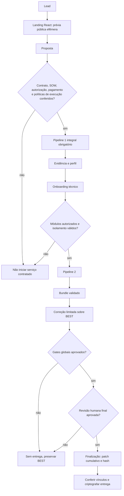

# Pipeline de geração de leads para revisão de segurança

Estado local e publicação da landing atualizados em 26/09/2026:
[estado atual e prioridades](docs/ESTADO_ATUAL.md).
Nenhuma IA de produção foi escolhida ou ativada. O
[roadmap de negócios/tecnologia](docs/ROADMAP_TECNOLOGIA_NEGOCIOS_2026-09-11.md)
preserva o backlog externo e histórico.

O [roteiro de validação local](docs/VALIDACAO_LOCAL_MVP.md) reúne os comandos
de CI, a matriz de gates, o ensaio de cliente fictício e os bloqueios externos.
[Resultado do lote atual](validacao/2026-09-13-lote-completo/RESULTADO.md).

O fluxo público foi atualizado: o site executa somente o Pipeline 0.5, sem
persistência. O Pipeline 1 integral foi retirado da oferta gratuita e passa a
ser executado somente depois de uma contratação e autorização. Ele continua
obrigatório antes do Pipeline 2 e não é esvaziado quando o perfil fica vazio.

## O que existe

- runner Go em modo `plan` por padrão;
- schemas estritos para lead, escopo, política de engajamento, política de
  ferramenta, matriz de teste e log de execução;
- rede Docker exclusiva por engajamento, egress `DROP` no `DOCKER-USER`,
  bloqueio do acesso ao host no `INPUT`, canaries positivo/negativo, parada de
  emergência e teardown;
- executor Docker por digest, timeout externo, hashes de políticas/insumos,
  SBOM e revisão de código fail-closed;
- proxy HTTP/SOCKS5 para auditoria, sem tratá-lo como barreira de segurança;
- HIBP por e-mail público e dnsReaper automatizados no Pipeline 1;
- normalização, deduplicação, ranking explicável, relatório e comparação de
  engajamentos no modelo canônico;
- correção por ticket em worktree isolado, gates finitos, comparação de postura
  e retenção monotônica da melhor versão;
- uma única revisão humana, no final e vinculada aos hashes entregues.
- geração de propostas por protocolo independente de fornecedor e comando
  `remediation-run` até a revisão final, com transporte desativado no exemplo,
  verificadores separados e ensaio por gerador simulado, não IA real;
- primeiro caso real local de correção executado sobre o ZIP CER-Fácil; o
  melhor candidato passou nos gates técnicos e aguarda revisão humana final.
- landing publicada em `vexkeep.com`, com Pipeline 0.5 síncrono e ampliado,
  oferta posterior, sem ativar Pipeline 1 ou pagamento pela interface;
  botão Google em produção com credenciais configuradas; o teste de
  consentimento, sessão e saída permanece pendente. Apple saiu da interface;
  a conta não autoriza testes;
- implementação local e pausada do Vexkeep Check v1: caso com prova de domínio, D1,
  máquina de estados, acesso por dois códigos, job pull, relatório saneado,
  cancelamento e exclusão; D1 de staging criado e migrado, com cooldown,
  heartbeat e stale sweeper; permanece desligado até política dinâmica, host
  Linux, runner e pagamento autenticado serem validados; endpoints públicos e
  scheduler ficam desabilitados por padrão.

## Organização do repositório

- `pipeline/`: motor compartilhado de verificação, normalização e correção;
- `correcao/`: contratos, configuração de exemplo e documentação da correção;
- `landing-page/`: site React, isolado do motor operacional;
- `negocio/juridico/`: pacote contratual canônico e checklists operacionais;
  revisão documental atualizada em 11/09/2026, ainda dependente de dados da
  prestadora, revisão profissional e provedor de assinatura. Checklists não
  são validação criptográfica nem integração automática de contratação;
- `validacao/`: somente ensaios, evidências e resultados de validação.
- `pipeline/knowledge/hipporag/`: consulta Graph RAG local exposta ao Codex
  por MCP; o índice e os caches ficam fora do Git.

## Estado real de prontidão

O fechamento técnico de agosto registrou as seguintes verificações (não
equivale à liberação comercial nem à validação de um provedor de IA):

- as 28 entradas receberam revisão de adoção no commit exato: 20 foram
  aprovadas somente para seus wrappers governados e oito foram restringidas;
- as 20 ferramentas automáticas possuem runtime por digest, contrato de
  liveness e SBOM; nenhuma ferramenta executável ficou sem container;
- as 20 imagens passaram no `runtime-check --pull --strict`; as oito entradas
  manuais/desligadas/infraestrutura são recusadas pelo executor;
- firewall, Docker, proxy e canaries passaram no ensaio integrado Linux root;
- instalação limpa/reprodutível, adulteração de artefato, limites de saída,
  deduplicação com 5.000 bundles, corrida de dados e ciclo de correção foram
  testados;
- o fluxo de correção agora possui `remediation-preflight`: plano algum é
  criado antes de resolver e conferir o SHA-256 do agente e de todos os gates.

Isso deixa o produto **tecnicamente preparado para onboarding, mas não libera
um caso real por default**. Cada deploy ainda precisa substituir os exemplos
TEST-NET/placeholders por política, SOW, escopo e adaptadores daquela stack, e
executar `deploy-preflight-linux.sh` no host Linux escolhido. São entradas do
engagement, não pendências que possam ser preenchidas genericamente sem
inventar autorização ou comandos do cliente.

O caso CER-Fácil permanece candidato à revisão humana final. Seus ToolRuns são
anteriores ao fechamento desta cadeia; precisam ser reexecutados pelo runner
governado atual antes de qualquer autorização de entrega.

As verificações e correções do CER-Fácil ocorreram somente na cópia local do
ZIP fornecido; nenhum alvo remoto do projeto foi testado. A landing React foi
publicada separadamente e seu endpoint web não executa o caso CER-Fácil.

Documentos principais:

- [especificação vigente](docs/PIPELINE_DE_GERACAO_DE_LEADS.md)
- [arquitetura implementada](docs/ARQUITETURA_IMPLEMENTADA.md)
- [cadeia de ferramentas](docs/CADEIA_DE_FERRAMENTAS.md)
- [modelo canônico](docs/MODELO_CANONICO_E_NORMALIZACAO.md)
- [consulta Graph RAG](pipeline/knowledge/hipporag/README.md)
- [fluxo de correção segura](correcao/docs/FLUXO_DE_CORRECAO_SEGURA.md)
- [geração de patches sem fornecedor definido](correcao/docs/GERACAO_PATCHES_SEM_PROVEDOR.md)
- [fechamento da prontidão operacional](validacao/2026-08-22-fechamento-prontidao-operacional/RESULTADO.md)
- caso e reteste do CER-Fácil: evidências mantidas somente no ambiente local;
- [validação de isolamento/políticas](validacao/2026-08-22-isolamento-politicas/RESULTADO.md)
- [diagramas Mermaid detalhados](docs/DIAGRAMAS_MERMAID.md)
- [landing comercial e operação pública](docs/LANDING_COMERCIAL_E_OPERACAO_PUBLICA.md)
- [Pipeline 0.5 web](docs/PIPELINE_0_5_WEB.md)
- [plano e limites do Vexkeep Check v1](docs/PLANO_VEXKEEP_CHECK_V1.md)
- [auditoria e plano revisado de fechamento](docs/PLANO_CORRECAO_VEXKEEP_REVISADO_2026-08-26.md)
- [artefatos mínimos de negócio](negocio/README.md)
- [validação do D1 e controles do Check em staging](validacao/2026-08-26-vexkeep-check-staging/RESULTADO.md)
- [validação e deploy do Pipeline 0.5 web](validacao/2026-08-26-pipeline-0-5-web/RESULTADO.md)

## Estado do primeiro caso

Há um perfil executável ensaiado ponta a ponta em laboratório privado. Os
runbooks estão em `docs/runbooks/`, o perfil em
`correcao/adapters/python-3.13-stdlib/` e o resultado saneado em
`validacao/2026-08-24-primeiro-caso-controlado/`.

Antes de caso real, o Linux dedicado precisa passar drift/preflight como root.
HIBP, OAST público, terceiros e múltiplas stacks ficaram fora. A landing está
publicada, mas a integração com o runner integral permanece pendente.

## Navegação e atualização documental

Use o [índice de documentação](docs/INDICE_DOCUMENTACAO.md) para distinguir
guias atuais, modelos não liberados e registros históricos. Os
[diagramas atuais](docs/DIAGRAMAS_MERMAID.md) incluem geração, entrega do patch
canônico, autenticação e aceitação do host. As setas da jornada não representam
integração de cobrança/assinatura já ativa. A atualização documental não é deploy.
