# Vexkeep — fluxo governado de verificação e correção

Repositório privado do motor técnico da Vexkeep. A landing comercial, o plano
de negócios, fontes de clientes e resultados brutos não fazem parte deste
repositório. Quatro modelos jurídicos não preenchidos em `negocio/juridico/`
são insumos do ensaio sintético; não representam documentos aprovados ou
assinados.

Estado de 22/09/2026: o motor inclui geração de propostas de patch por contrato
independente de fornecedor, gates separados, entrega vinculada a hash e ensaio
sintético do primeiro cliente. Não há provedor de IA ativado nem host de produção
aprovado. Consulte o [estado do fluxo](docs/ESTADO_FLUXO.md) para limites e
pendências concretos.

```mermaid
flowchart LR
    contract[Contratação e autorização] --> p1[Verificação de superfície pública]
    p1 --> evidence[Evidência normalizada e perfil]
    evidence --> onboarding[Onboarding e políticas]
    onboarding --> p2[Verificações autorizadas]
    p2 --> bundle[Bundle validado]
    bundle --> remediation[Correção sobre a melhor versão]
    remediation --> review[Revisão humana final]
    review --> delivery[Entrega]
```



## Conteúdo

- `pipeline/`: CLI Go, schemas, políticas, normalização, isolamento, execução,
  relatórios, supply chain e orquestração da correção;
- `correcao/`: contratos, adaptador validado e documentação do fluxo de
  correção monotônica;
- `deploy/`: baseline e preflight do host Linux;
- `docs/`: arquitetura, decisões, cadeia de ferramentas e runbooks;
- `validacao/`: evidências saneadas de prontidão, isolamento e primeiro caso
  controlado.

## Garantias implementadas

- modo `plan` por padrão e execução fail-closed;
- escopo, autorização, janela, ferramentas e exceções versionados;
- runtimes fixados por digest ou artefato com SHA-256;
- SBOM, lockfiles, revisão de adoção e verificação de supply chain;
- rede isolada por engajamento, egress controlado, proxy auditável, canaries,
  parada de emergência e teardown;
- modelo canônico para deduplicação, ranking explicável, evidência, relatório
  e comparação entre execuções;
- correção por ticket em worktree isolada, gates finitos e retenção da melhor
  postura de segurança;
- uma revisão humana final vinculada aos hashes entregues.
- geração automática até a revisão final, com transporte externo desativado
  até existir um provedor aprovado e autorização específica;
- patch cumulativo derivado do diff da melhor versão, conferido na entrega.

## Validação mínima

Na pasta `pipeline/`:

```text
go vet ./...
go test -race -count=1 ./...
go run ./cmd/pipeline supply-chain --lock tools.lock.json --sbom sbom.cdx.json --strict
python3 scripts/check_docs.py --profile flow
```

O host de execução precisa passar `deploy-preflight-linux.sh` como root antes
de qualquer caso real. Exemplos TEST-NET e placeholders nunca autorizam uma
execução contra terceiros.

## Documentos principais

- [arquitetura implementada](docs/ARQUITETURA_IMPLEMENTADA.md)
- [especificação vigente](docs/PIPELINE_DE_GERACAO_DE_LEADS.md)
- [cadeia de ferramentas](docs/CADEIA_DE_FERRAMENTAS.md)
- [modelo canônico](docs/MODELO_CANONICO_E_NORMALIZACAO.md)
- [fluxo de correção segura](correcao/docs/FLUXO_DE_CORRECAO_SEGURA.md)
- [operação do host](docs/runbooks/OPERACAO_HOST.md)
- [fechamento de prontidão](validacao/2026-08-22-fechamento-prontidao-operacional/RESULTADO.md)
- [isolamento integrado](validacao/2026-08-22-isolamento-politicas/RESULTADO.md)

## Limites

Este código não substitui autorização, SOW, política do engajamento, revisão
jurídica ou confirmação humana final. O repositório não contém credenciais,
dados de clientes, fontes de projetos analisados nem evidências brutas.
