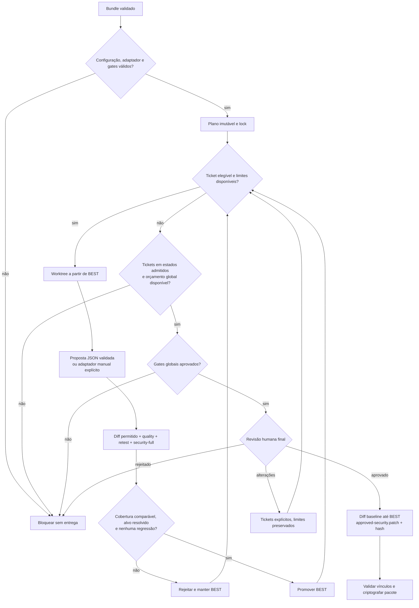

# Fluxo de correção segura

Estado consolidado em 13/09/2026: motor de agosto, geração de 11/09 e
vinculação do patch cumulativo/ensaios locais de 13/09. Geração por IA real ainda
desativada. Detalhes em [GERACAO_PATCHES_SEM_PROVEDOR.md](GERACAO_PATCHES_SEM_PROVEDOR.md).

## Decisão sobre o diagrama

A proposta foi aceita parcialmente. Foram preservados ticket por achado,
critérios de aceite, branch/worktree isolado, correção cirúrgica, reteste,
validação global e entrega final. Foram alterados três pontos:

1. a aprovação humana por ticket foi removida; existe somente um gate humano
   final, depois da validação global;
2. a execução padrão é serial sobre a melhor versão retida, não paralela;
   isso elimina corrida de estado e regressões introduzidas pela combinação de
   branches. Dependências explícitas entre tickets ainda são validadas;
3. “corrigido” não é inferido apenas de build verde ou desaparecimento do
   alerta. A cobertura precisa ser comparável e o bundle completo não pode
   conter achado novo, aumento de severidade ou aumento de rank.

O modelo serial é deliberado para o MVP. Paralelismo só deve ser adicionado
depois de existir prova automática de independência de arquivos, dependências
e comportamento entre tickets.

## Fluxo vigente



O diagrama completo, incluindo preflight e backup/entrega, está em
[`../../docs/DIAGRAMAS_MERMAID.md`](../../docs/DIAGRAMAS_MERMAID.md).

## Invariantes implementados

- `security_changes_only=true` e `human_review_stage=final` são constantes do
  schema, não opções;
- antes do plano, o preflight resolve o agente e todos os gates, recusa hash
  placeholder, confere SHA-256 e valida os diretórios de trabalho; a execução
  torna a conferir o mesmo hash;
- um lock exclusivo impede duas alterações concorrentes de `state.json`;
- cada tentativa parte do commit `BestRef` atual em worktree Git relacionado;
- o adaptador legado roda por argv direto, executável pinado, timeout e
  ambiente reduzido; o modo novo recebe propostas JSON via gateway, sem shell
  para o modelo. Nos dois caminhos, a CLI cria o commit e verifica o diff;
- o candidato precisa descender de `BestRef` e ser o `HEAD` do worktree
  preparado para o ticket;
- arquivos fora da allowlist, caminhos protegidos, remoção de testes,
  binários, dependências não autorizadas e limites de diff bloqueiam promoção;
- todos os gates são obrigatórios, executados por argv direto, sem shell, com
  executável pinado por SHA-256, timeout, ambiente reduzido, log limitado a 1
  MiB e hashes de logs/artefatos;
- o gate security precisa atestar por SHA-256 o bundle candidato informado ao
  avaliador;
- scope fingerprint e cobertura exata de ferramenta, versão, status, parser,
  versão do parser, digest do container, política, comando e estado de supply
  chain precisam coincidir com `BEST`; todo ToolRun candidato precisa ter
  `supply_chain_status=runner-gated` e exceção bloqueante torna o bundle
  incomparável;
- novo finding, aumento de severidade/rank ou alvo ainda ativo rejeitam o
  candidato;
- rejeição não altera `BestRef` nem o melhor bundle;
- tentativas são limitadas por ticket e por caso; não existe loop infinito;
- a revisão final fica vinculada ao commit e ao SHA-256 do melhor bundle;
- uma solicitação humana de alterações só reabre tickets explícitos e continua
  sujeita aos mesmos limites e à não regressão.

## Limite da regra “somente segurança”

O motor comprova escopo de arquivos, tamanho do diff, testes e postura de
segurança. Nenhuma regra genérica consegue provar semanticamente que todo hunk
de qualquer linguagem tem apenas finalidade de segurança. Por isso cada gate
de qualidade deve incluir os testes de compatibilidade do projeto, o prompt
proíbe refatoração oportunista e a única revisão humana final confirma o diff
completo. Mudança de produto, UI, conteúdo, arquitetura ou desempenho sem
necessidade direta para corrigir o achado deve ser rejeitada.

## Contrato dos gates

O arquivo `remediation.json` deve conter pelo menos:

- `agent`: `builtin:patch-proposal` com hash do runner e configuração explícita
  de geração, ou adaptador manual pinado; nenhum deles tem poder de promoção;
- `quality`: build, lint, typecheck e testes do projeto;
- `security`: execução completa dos verificadores governados e produção de
  `candidate-bundle.json`;
- `retest`: reprodução específica do achado;
- `smoke`: opcional na tentativa, obrigatório por estar incluído no gate
  global quando configurado.

O adaptador de agente e os comandos dos gates não podem instalar ferramentas em
tempo de execução. O comando do gate security deve chamar os scanners pelo
executor governado já existente: versão/release pinada, revisão aprovada, SBOM
e container por digest.
O exemplo contém nomes de adaptadores e caminhos fictícios; deve ser substituído
pelos comandos reais do ambiente e pelo SHA-256 de cada adaptador. Não instale
dependências durante o gate.

## Uso manual explícito e diagnóstico

A sequência abaixo é o caminho individual/manual, não uma exigência de
intervenção por ticket no modo automático. Após configurar e homologar o
gateway, use `remediation-run` conforme o guia de geração; ele para na revisão
final. Não há fallback manual silencioso.

```powershell
cd pipeline
go build -o bin/pipeline.exe ./cmd/pipeline

# 0. Bloqueia placeholders, executável ausente ou hash divergente.
.\bin\pipeline.exe remediation-preflight --config ..\correcao\config\remediation.json --output C:\runtime\remediation-readiness.json --strict

# 1. Gera plano, tickets, prompts e estado inicial; repete o preflight.
.\bin\pipeline.exe remediation-plan --config ..\correcao\config\remediation.json

# 2. Prepara um worktree sobre a melhor versão atual.
.\bin\pipeline.exe remediation-worktree --config ..\correcao\config\remediation.json --plan C:\runtime\CASE-001\remediation\plan.json --ticket REM-0123456789AB

# 3. Executa o agente pinado e cria o commit candidato no worktree.
.\bin\pipeline.exe remediation-agent --config ..\correcao\config\remediation.json --plan C:\runtime\CASE-001\remediation\plan.json --ticket REM-0123456789AB

# 4. Executa os gates sobre o commit retornado pelo agente.
.\bin\pipeline.exe remediation-gates --config ..\correcao\config\remediation.json --plan C:\runtime\CASE-001\remediation\plan.json --ticket REM-0123456789AB --phase candidate --candidate-ref COMMIT --worktree C:\CAMINHO\WORKTREE

# 5. Avalia; somente "promote" substitui BEST.
.\bin\pipeline.exe remediation-evaluate --config ..\correcao\config\remediation.json --plan C:\runtime\CASE-001\remediation\plan.json --ticket REM-0123456789AB --candidate-ref COMMIT --candidate-bundle C:\CAMINHO\candidate-bundle.json --gate-run C:\runtime\CASE-001\remediation\gates\REM-*\RUN\gate-run.json

# 6. Após todos os tickets, rode gates/evaluate com --phase global/--global.
# 7. O humano revisa somente a melhor versão global e registra approval.json.
.\bin\pipeline.exe remediation-finalize --config ..\correcao\config\remediation.json --plan C:\runtime\CASE-001\remediation\plan.json --approval C:\runtime\approval.json --output C:\runtime\FINALIZACAO-NOVA\delivery-authorization.json
```

## Base técnica

O desenho segue a prática de análise/teste contínuo e resposta a
vulnerabilidades do [NIST SSDF SP 800-218](https://csrc.nist.gov/pubs/sp/800/218/final),
usa [Git worktree](https://git-scm.com/docs/git-worktree.html) para isolamento
e aplica revisão de diff e teste de regressão conforme o
[OWASP Secure Code Review Cheat Sheet](https://cheatsheetseries.owasp.org/cheatsheets/Secure_Code_Review_Cheat_Sheet.html).
Em hospedagem central, os mesmos gates devem ser exigidos como status checks em
branch protegida, conforme a
[documentação do GitHub](https://docs.github.com/en/repositories/configuring-branches-and-merges-in-your-repository/managing-protected-branches/about-protected-branches).

## Prontidão real

O control-plane passou no ciclo sintético completo: rejeição preserva `BEST`,
promoção exige cobertura comparável, gates globais antecedem a aprovação única
e limites encerram tentativas. A cadeia de scanners também foi fechada: 20
entradas automáticas estão aprovadas para seus wrappers, por digest e com
liveness; oito ficam restritas.

Os adaptadores/gates do arquivo genérico de exemplo continuam sendo
deliberadamente inválidos. A geração agora tem protocolo e aplicação próprios,
mas seu gateway, fornecedor/modelo/esforço e credencial continuam indefinidos.
Não existe um comando universal correto
para build/test/reteste de todas as stacks, nem um provedor de IA escolhido
pelo projeto. Em vez de inventá-los, o motor agora os trata como entrada de
onboarding e impede até a criação do plano enquanto executáveis e hashes reais
não passarem no `remediation-preflight`.

## Primeira aplicação em projeto fornecido

O ZIP CER-Fácil foi corrigido em cópia Git isolada e retestado em 22 de agosto
de 2026. O candidato local resolveu cinco achados, mitigou três e preservou um
por decisão de escopo, sem novo achado validado. A execução demonstrou a regra
de manter a melhor versão, mas não emitiu autorização de entrega: os ToolRuns
arquivados são anteriores ao fechamento atual e precisam ser repetidos pelo
runner governado antes da revisão humana final. Consulte
`correcao/casos/2026-08-22-cer-facil/` e
`validacao/2026-08-22-cer-facil-correcao/`.

## Implementação concreta do primeiro caso

No perfil Python manual original, o adaptador recebe um patch externo no
caminho exato do ticket. No novo modo de geração, o runner recebe propostas de
conteúdo pelo protocolo versionado e produz o patch. O orquestrador
valida escopo, aplica em worktree isolada, executa quality, retest e
security-full, gera bundle canônico e compara com BEST. Promoção exige gates,
cobertura comparável e ausência de regressão.

O gate global repete a suíte protegida sobre o BEST acumulado. A aprovação
humana final liga commit e hash do bundle. O pacote só é gerado após finalize;
divergência de plano, estado, aprovação, commit, bundle ou patch bloqueia.

## Entrega vigente e validação

Na aprovação final, `remediation-finalize` gera `approved-security.patch`
ao lado da autorização e grava seu SHA-256. O diff é cumulativo, do baseline
até BEST, e o renderer recebe esse arquivo pronto, sem precisar de Git.
`delivery-package` recusa `--patch-root` e hashes divergentes. O diretório de
finalização deve ser novo; autorizações antigas exigem nova finalização com
a revisão aplicável, não preenchimento manual de hash.

O [kit sintético](../avaliacao/README.md) testa positivos, rejeições e limites;
o [ensaio integrado](../../validacao/2026-09-13-lote-completo/RESULTADO.md)
inclui revisão simulada, pacote cifrado e restore. Não é homologação de IA,
scanners de cliente, assinatura ou host real.
