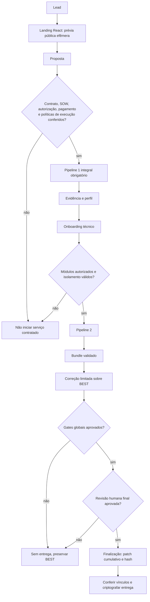

# Arquitetura implementada

Estado: base de agosto, com geração de patches em 11/09 e fechamento local em
13/09/2026. Consulte o [estado consolidado](ESTADO_ATUAL.md), inclusive a nova
vinculação do patch cumulativo à autorização final.
O [roteiro local](VALIDACAO_LOCAL_MVP.md) reúne comandos e limites das
verificações repetidas nesta atualização; o deploy definitivo continua pendente.

## Fluxo preservado

O Pipeline 0.5 não é uma categoria ou versão esvaziada do Pipeline 1. Não
existe bypass do Pipeline 1 integral depois da contratação se o
perfil ficar vazio. A origem do lead é hipótese; o fingerprint produz o perfil,
e o onboarding confirma/ajusta os módulos do Pipeline 2.

## Pipeline 0.5 web

O Worker da landing executa uma leitura síncrona, efêmera e de baixo impacto.
Ela cobre DNS público, HTTP/HTTPS, oito cabeçalhos, CSP, atributos agregados de
cookies, SPF/DMARC/MX/DNSSEC/CAA, security.txt, Certificate Transparency
limitada e fingerprint textual de até dois scripts do mesmo host. Cada corpo é
limitado por streaming; redirects não são seguidos; resoluções privadas e
reservadas são recusadas; o orçamento total é de 46 subrequisições externas.

O resultado apresenta no máximo oito observações com evidência resumida,
significado e limitação. Na prévia não há score, autenticação no alvo, execução de JavaScript do
alvo, teste de portas, exploração, mutação ou persistência do domínio/resultado.
O login social da plataforma é um subsistema separado, com sessões em D1.
Os endpoints públicos e o scheduler do Check ficam desabilitados por padrão
por `CHECK_PUBLIC_ENABLED`. Ativar essa flag não autoriza por si só o runner
P1/P2, nem conclui a integração com o host governado.

Os diagramas detalhados de isolamento, correção monotônica e entrega estão em
[`DIAGRAMAS_MERMAID.md`](DIAGRAMAS_MERMAID.md).

## Núcleo de políticas

O runner valida seis schemas estritos:

- `lead.schema.json` e `scope.schema.json`;
- `engagement-policy.schema.json`: alvo, IP, porta, taxa, budget,
  autorização/observação pública, APIs externas, DNS, NS e canaries;
- `tool-policy.schema.json`: modo, pipeline, pin, duração e todas as flags;
- `test-matrix.schema.json`: recursos e identidades autorizados;
- `execution-log.schema.json`: trilha emitida pelo executor.

Os demais contratos acrescentam `onboarding-input.schema.json`,
`scenarios.schema.json`, `remediation-config.schema.json`,
`remediation-readiness.schema.json`, `remediation-approval.schema.json`,
`patch-generation-request.schema.json` e `patch-generation-response.schema.json`:
13 schemas no conjunto atual. Todo objeto aninhado usa
`additionalProperties: false`. Flags perigosas são
obrigatórias, e `claim_resource`, `auto_register_accounts` e
`apply_changes` são `const: false`.

Pipeline 1 usa `public_observation.acknowledged=true`. Pipeline 2 exige
`authorization.confirmed=true`. A CLI não possui confirmação paralela capaz de
alterar essas políticas.

## Isolamento Linux

Para cada engajamento o runner gera e, no modo execute, aplica:

1. bridge Docker dedicada, sem IPv6;
2. chain própria no `DOCKER-USER`, com DNS e destinos IP:porta permitidos e
   `DROP` final;
3. chain própria no `INPUT`, bloqueando acesso dos containers ao host;
4. exceções `INPUT` apenas para as portas efêmeras do proxy de auditoria;
5. canary negativo em endpoint controlado pelo operador, primeiro validado via
   host e depois obrigatoriamente bloqueado pela rede do engajamento;
6. canary positivo no destino permitido;
7. parada de emergência e teardown idempotente.

A execução exige Linux root. Em 22 de agosto, o ciclo foi validado de ponta a
ponta em um host Linux root descartável (`docker:dind` 29.6.2 por digest):
bridge exclusiva, regras `DOCKER-USER`/`INPUT`, canary negativo bloqueado,
canary positivo permitido e uma requisição HTTP pelo proxy com `RequestLog`
`allowed_pinned`. A evidência está em
`validacao/2026-08-22-isolamento-politicas/linux-root-integration/case-success/`.
O ensaio é controlado e não contém ativos de terceiros; não substitui a
validação operacional no host Linux que será usado no deploy.

## Executor governado

Ferramentas externas só rodam em container:

- imagem referenciada por digest;
- entrada existente no `tools.lock.json` e no SBOM;
- revisão de código `approved`;
- política de ferramenta `automatic`;
- timeout com `context.WithTimeout`;
- insumos externos montados read-only; pasta do caso como saída;
- hashes de políticas e insumos no execution log;
- saída, erro e artefatos registrados; arquivos efêmeros sensíveis removidos.

As 20 entradas automáticas têm digest e liveness aprovados; as oito demais são
explicitamente restritas e não chegam ao executor. O runtime aplica
`--pull=never`, rootfs somente leitura, capabilities zeradas,
`no-new-privileges`, limites de CPU/memória/PIDs/descritores, tmpfs controlado e
logs limitados. Artefatos locais de Subfinder, Hadrian, jsluice e sqlmap são
verificados por SHA-256 antes da montagem read-only.

Uma falha de gate aborta o engajamento. Não há flag de bypass.

## Transporte e auditoria

O HTTP nativo e o proxy reutilizam allowlist de scheme/host/porta e resolução
pinada por política, fechando nova resolução entre validação e conexão. O proxy
HTTP/SOCKS5 existe para RequestLog e atribuição por `run_id`; o firewall é a
barreira principal. Em HTTPS sem MITM, o proxy registra o túnel `CONNECT`, não
o conteúdo nem cada request.

## Pipeline 1

- Subfinder e Amass passivo;
- httpx, HTTP público nativo, headers, CORS controlado, DNS e CT autorizado;
- download limitado de bundles do mesmo host;
- jsluice/Gitleaks/TruffleHog offline; TruffleHog recebe
  `--no-verification`;
- dnsReaper automático somente sobre lista curada, sem claim e sempre
  candidato;
- HIBP automático somente por e-mail corporativo publicado, sem busca por
  domínio, sem persistir e-mail bruto no resultado;
- keyleak-detector desligado;
- perfil, relatório, manifesto, normalização e checksums.

## Pipeline 2

- feroxbuster como content discovery padrão; ffuf fica alternativa desativada;
- Amass ativo com autorização, datasources explícitas e NS permitidos;
- Schemathesis e Hadrian sobre OpenAPI obtido pelo transporte pinado;
- Hadrian v1.0.0 para BOLA/BFLA; AuthProbe não roda junto e está desligado;
- scenario runner apenas para crédito/billing com estado antes/depois;
- Nuclei com templates locais; OAST somente self-hosted;
- ZAP por YAML final renderizado, autenticação verificada, rotas destrutivas
  excluídas e duração finita;
- jwt_tool passos 1–3; Dalfox só reflexão; sqlmap apenas request/parâmetro
  capturados;
- SupaShield desligado por incompatibilidade de versão/contrato; RLS-Checker e
  firepwn manuais/GUI;
- Gitleaks, OSV-Scanner, Semgrep e Trivy sobre repositório autorizado;
- keyleak ativo e rlsgate continuam desligados.

## Modelo canônico

`Asset`, `Finding`, `Evidence`, `ToolRun`, `RequestLog`,
`Engagement`, `Scope` e `Exception` sustentam deduplicação, ranking,
relatório, comparação e integridade. Alertas nascem como `candidate`. A única
promoção automática estreita é Hadrian com setup, ataque e verificação do
efeito nas três fases.

## Consulta Graph RAG

HippoRAG 2 é a camada interna de recuperação que o Codex consulta por MCP
antes de varrer arquivos do fluxo. O Codex produz a resposta; o MCP devolve no
máximo seis trechos relevantes e suas fontes. Ele indexa corpus restrito de
documentação, configurações, código do motor e evidências finais de
prontidão/isolamento. Não recebe `correcao/casos/`, binários, artefatos
operacionais, caches ou a landing page; assim mantém os dois repositórios
privados separados e não inclui o caso CER-Fácil.

Não há `OPENAI_API_KEY`, chamada à API ou envio de conteúdo do projeto nessa
camada. O grafo é extraído deterministicamente de termos e relações textuais,
e os embeddings são locais por hashing. A qualidade é adequada para localizar
documentação, políticas e decisões; não é equivalente a OpenIE semântico por
LLM. O fingerprint é conferido em toda consulta MCP: se o corpus permitido
mudar, o índice é reconstruído automaticamente antes da resposta. Os arquivos
versionados continuam sendo a fonte de verdade e a base de qualquer decisão
operacional.

## Correção segura

Cada finding validado gera um ticket e um prompt tratado como dado não
confiável. A CLI cria um Git worktree por tentativa sobre `BestRef`. O caminho
legado executa adaptador pinado por SHA-256; o novo `builtin:patch-proposal`
recebe propostas JSON de um gateway e não dá shell/filesystem ao modelo. A CLI
valida as alterações e cria o commit candidato. O agente não decide promoção. O avaliador verifica
ancestralidade/HEAD, allowlist de caminhos, arquivos protegidos, remoção de
testes, dependências, binários e limites do diff.

Os gates rodam por argv direto, com executável pinado por SHA-256, timeout,
ambiente reduzido e integridade de logs/artefatos. O bundle de segurança precisa ter o mesmo scope fingerprint e
a mesma cobertura exata de ferramenta/versão/parser/supply chain. Novo achado,
aumento de severidade/rank, reteste insuficiente ou qualquer gate obrigatório
rejeitam o commit e preservam a versão anterior. Há limites por ticket e por
caso, execução serial e lock de estado; portanto não existe loop infinito nem
promoção concorrente.

Antes de criar o plano, `remediation-preflight` resolve o executável do agente
e de cada gate, recusa hash placeholder, calcula o SHA-256 real e valida o
working directory. `remediation-plan` repete o mesmo gate. Cada execução torna
a conferir o binário, reduzindo a janela para troca após o preflight.

Depois de todos os tickets, a melhor versão passa por todos os gates globais.
Só então ocorre a única revisão humana. `approved` autoriza entrega;
`changes_requested` reabre tickets explícitos dentro dos limites; `rejected`
bloqueia o caso. A decisão é vinculada ao commit e SHA-256 do bundle.

Atualização de 11/09/2026: `remediation-run` automatiza as tentativas do novo
modo e para em `awaiting_final_review`, sem criar aprovação ou entrega. O
protocolo é independente de fornecedor; provedor/modelo/effort e credencial
permanecem indefinidos por decisão do usuário. O ensaio usa gerador simulado,
não comprova a qualidade de uma IA real. Configuração, controles e pendências:
[geração de patches](../correcao/docs/GERACAO_PATCHES_SEM_PROVEDOR.md).

## Prontidão

O fechamento histórico da cadeia registrou 20 ferramentas automáticas que foram
aprovadas para os wrappers exatos, receberam runtime por digest e passaram no
liveness; oito foram restringidas; não há `pending`. O ciclo Linux root de
firewall/proxy/canaries passou, o runner e quatro artefatos próprios têm receita
reprodutível, e testes cobrem adulteração, limites de saída, 5.000 bundles,
race detector e o ciclo completo de correção.

A liberação continua deliberadamente por caso. Política/SOW, escopo, segredo
HIBP quando usado, adaptadores da stack e o preflight no host Linux real não
podem vir preenchidos no template. O motor falha fechado até essas entradas
serem fornecidas e verificadas.

O CER-Fácil permanece somente candidato à revisão humana final. Seus ToolRuns
arquivados foram produzidos antes deste fechamento; é necessário repetir a
cobertura com o runner governado atual antes de emitir autorização de entrega.

## Extensão do primeiro caso

O onboarding produz políticas e matrizes sem inferir autorização. O perfil
`python-3.13-stdlib` liga o adaptador manual aos três gates. A entrega deriva
exclusivamente do bundle BEST autorizado e é determinística antes da
criptografia. O bloco operacional Linux inclui baseline, drift, preflight,
preservação, monitor e backup/restauração.

O laboratório de referência usa dados falsos em repositório privado separado.
O lote local de 13/09 reforçou a landing, os testes e a entrega; não alterou
casos de clientes nem publicou a versão. O novo ensaio integrado é sintético.

## Consolidação de 13/09 e limites de confiança

A finalização deriva `approved-security.patch` do diff baseline → BEST,
insere `patch_sha256` na autorização e não aceita substituir o patch por um
arquivo externo. O empacotador valida os vínculos antes da criptografia.
O hash não substitui a decisão humana nem uma assinatura contratual.

O coletor local passou em 21 verificações; a POC usa sete cenários e o ensaio
fictício chega ao restore. Detalhes e limites estão no
[relatório](../validacao/2026-09-13-lote-completo/RESULTADO.md).
A aceitação Linux foi preparada, não executada no host definitivo.
O GraphRAG conectado retornou trechos antigos nesta conferência; reconstrução
automática vale para o corpus configurado, não para qualquer worktree aberta.
