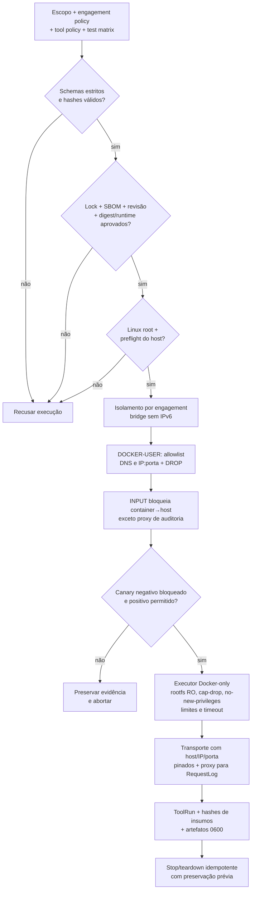
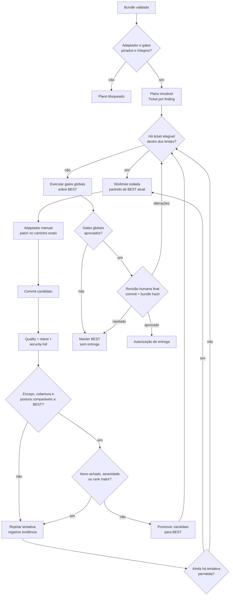
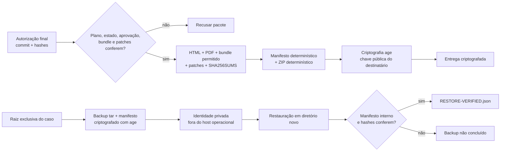

# Diagramas Mermaid do fluxo vigente

Os diagramas abaixo representam apenas caminhos executáveis e gates que mudam
o resultado. Eles não representam ferramentas restritas como se fossem etapas
automáticas nem criam bypass para autorização, supply chain ou revisão final.

## 1. Jornada completa: geração, verificação e entrega

```mermaid
flowchart LR
    lead[Lead] --> landing[Landing page React]
    landing --> p1[Pipeline 1\nSuperfície pública e baixo impacto]
    p1 --> evidence[Evidência saneada\n+ stack profile]
    evidence --> outreach[Outreach baseado em achado real]
    outreach --> commercial{Contrato e\n pagamento confirmados?}
    commercial -- não --> stopCommercial[Encerrar sem Pipeline 2]
    commercial -- sim --> onboarding[Onboarding técnico\npor schema]
    onboarding --> policy{Escopo, autorização,\npolíticas e isolamento válidos?}
    policy -- não --> blocked[Fail-closed\nsem execução ativa]
    policy -- sim --> p2[Pipeline 2\nMódulos autorizados e roteados]
    p2 --> canonical[Normalização, deduplicação\ne ranking explicável]
    canonical --> report[Bundle canônico\n+ relatório validado]
    report --> remediation[Correção serial\nsobre BEST]
    remediation --> global[Gate global]
    global --> finalReview{Revisão humana final}
    finalReview -- aprovado --> delivery[Entrega vinculada\na commit e hashes]
    finalReview -- alterações --> remediation
    finalReview -- rejeitado --> closed[Encerrar sem entrega]
```

Regras visíveis no diagrama: Pipeline 1 sempre ocorre antes do onboarding; um
perfil de stack vazio não pula o fluxo. Pipeline 2 só começa após contrato,
pagamento e entradas técnicas válidas.

## 2. Execução governada e isolamento por engajamento

O proxy produz auditoria; firewall e políticas são as barreiras de segurança.
Falha de supply chain, canary ou preflight não possui caminho de continuação.

## 3. Correção monotônica sobre BEST

Somente `promote` altera BEST. Rejeições preservam a versão anterior, e limites
por ticket/caso impedem loop infinito.

## 4. Entrega e recuperação verificáveis

Determinismo aplica-se até o ZIP; o ciphertext age varia por desenho
criptográfico. A restauração verificada é requisito para considerar um backup
concluído.
