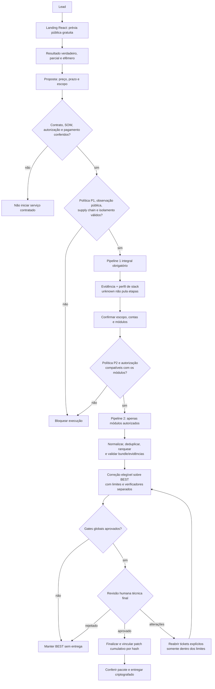
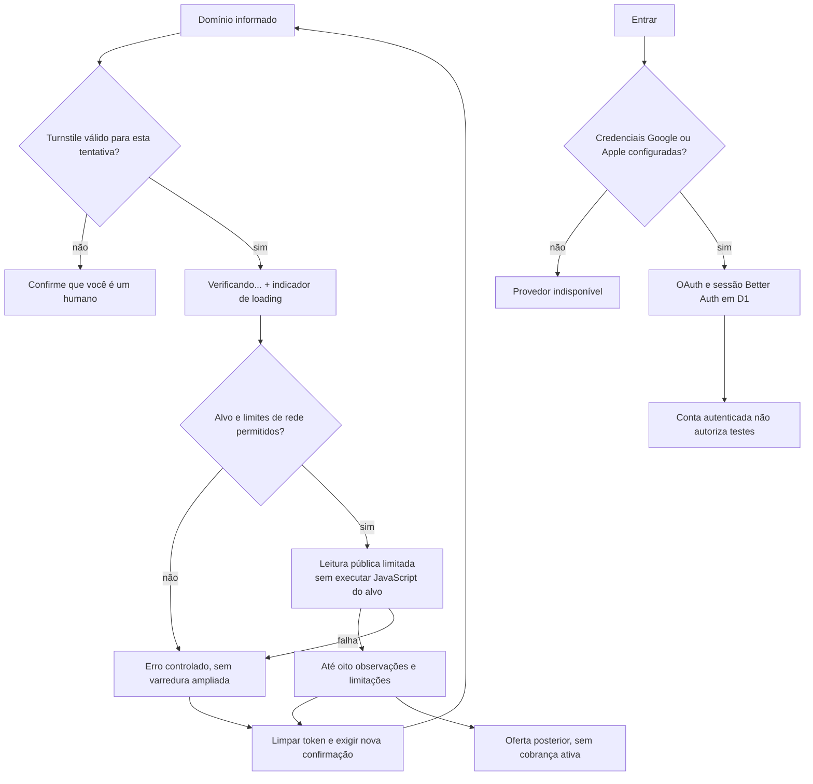
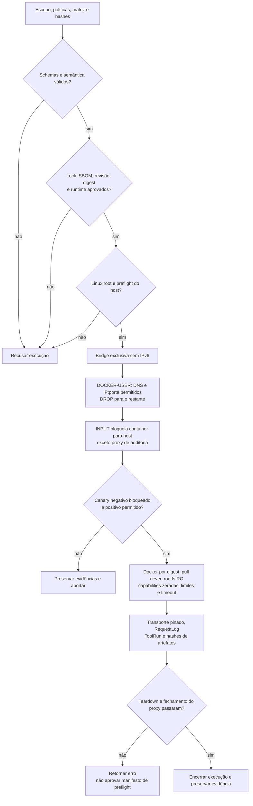
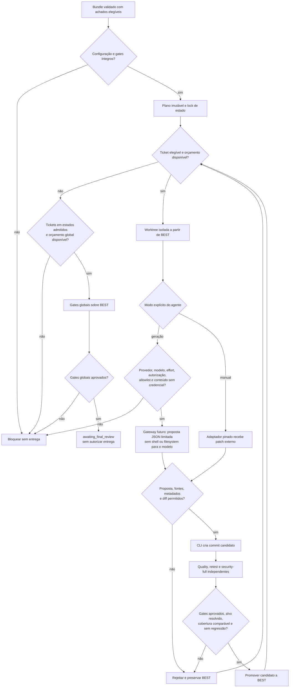
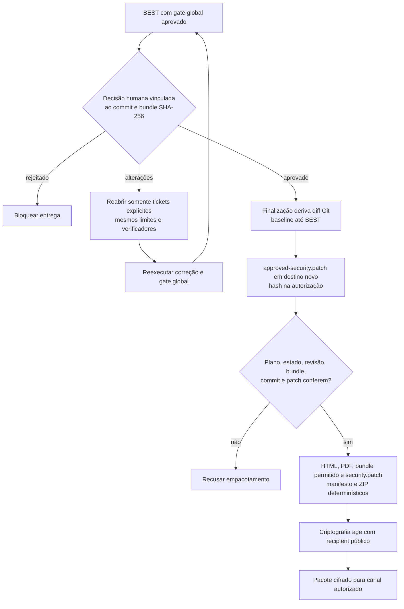
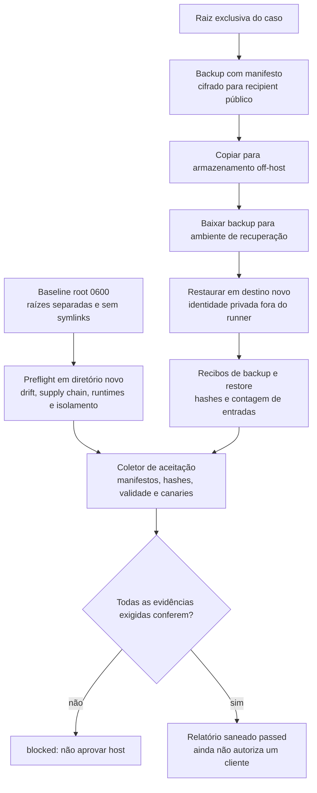
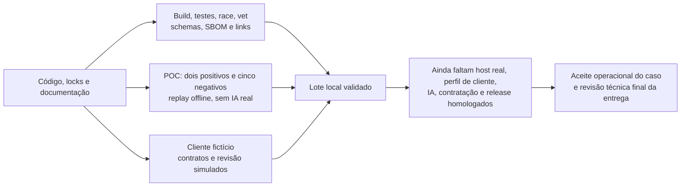

# Diagramas Mermaid do fluxo vigente

Atualização documental: 13/09/2026. Fontes: [estado atual](ESTADO_FLUXO.md),
[arquitetura](ARQUITETURA_IMPLEMENTADA.md) e
[geração de patches](../correcao/docs/GERACAO_PATCHES_SEM_PROVEDOR.md).

Os nomes de pipelines são internos, não textos da interface pública. Os
diagramas descrevem regras implementadas e a jornada pretendida; conexões
comerciais não significam integração automática já publicada. IA real, host
definitivo, assinatura e cobrança permanecem pendentes de homologação.

## 1. Jornada e fronteiras de autorização

Pagamento/login não autorizam testes. O motor P1 exige reconhecimento formal
da observação pública; o gate comercial é também procedimento operacional,
não validação criptográfica de contrato pelo runner. Sem achados elegíveis,
não inventar tickets: o plano de correção pode ficar bloqueado. A prévia
pública não inicia o runner nem persiste domínio/resultado como caso contratado.

## 2. Prévia pública e autenticação são caminhos separados

O caminho OAuth tem implementação local, mas não foi homologado com
provedores reais neste lote. D1/cookies de autenticação não significam
persistência do resultado da prévia. Check e scheduler continuam pausados.

## 3. Execução governada e isolamento

O proxy audita; firewall e políticas limitam a rede. HTTPS sem MITM registra
o túnel CONNECT, não cada requisição. Ferramentas restritas não têm caminho
automático. Teste histórico em Linux descartável não aprova o host definitivo.

## 4. Geração e correção sobre BEST

As tentativas consomem limites por ticket/caso, inclusive a reserva global.
Falhas incertas de geração não são repetidas indiscriminadamente. O modo
automático não recorre silenciosamente ao manual. Apenas a avaliação pode
promover BEST. A não regressão é relativa à cobertura e aos testes, não prova
universal de ausência de falhas. O gateway real continua desativado.

## 5. Revisão final e patch canônico

Não existe entrada livre de patches na entrega: `--patch-root` é recusado.
O renderer recebe o patch já finalizado e não precisa de Git. Autorizações
antigas sem `patch_sha256` exigem nova finalização com aprovação aplicável e
destino novo. Hashes provam integridade relativa aos registros do operador,
não identidade humana, assinatura contratual ou recebimento pelo cliente.
O ciphertext age não é determinístico.

## 6. Backup e aceitação do host

Copiar e baixar off-host são passos operacionais a executar no ambiente real.
O coletor não provisiona o host e não fornece atestação remota; usa evidências
do operador. Ver [aceitação do host](../deploy/linux/ACEITACAO.md).

## 7. Evidência local versus liberação real

O [relatório de 13/09](../validacao/2026-09-13-lote-completo/RESULTADO.md)
registra o que foi executado. Comparações da POC exigem mesmo fingerprint
do avaliador/runtime; custo só é estimado com premissas declaradas.
